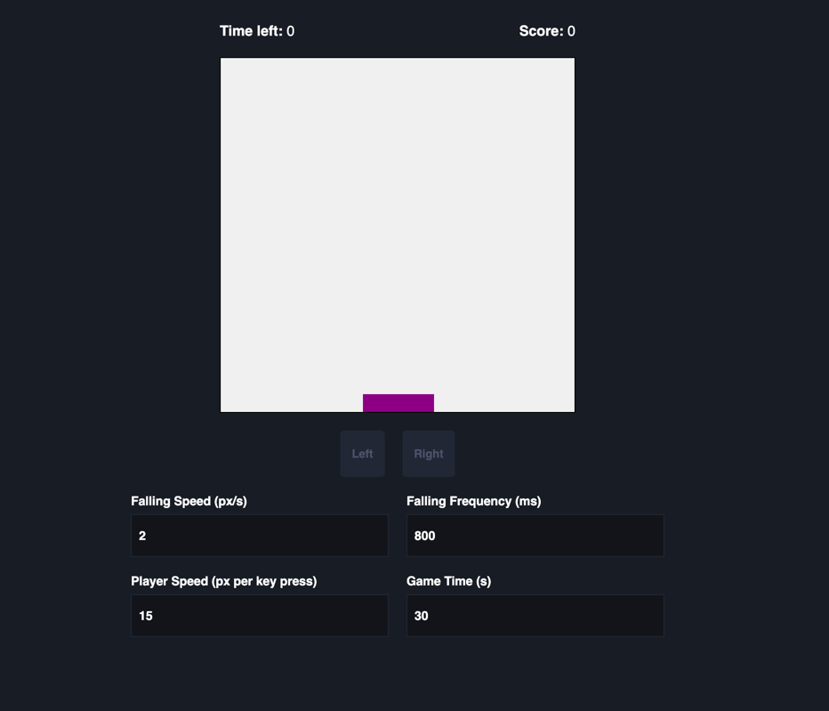

# Test task for Spribe company

This project is the test task for Spribe company for Senior Angular Developer position.

## Description of the task
Create a simple mini-game in Angular where the player controls a character (a
rectangle) that moves left and right to catch falling objects (balls). Points are awarded
for each caught object. The game ends after a set amount of time, configurable via a
settings form. The game starts only after filling out all the fields in the form.

### Main Requirements:

#### Game Settings Form
Implement a simple settings form using reactive forms to configure the game parameters. Form fields:
- Falling Speed (fallingSpeed): A number that determines how fast objects fall.
- Falling Frequency (fallingFrequency): A number that defines the delay between the appearance of new objects.
- Player Speed (playerSpeed): A number that sets the movement speed of the player character.
- Game Time (gameTime): The duration of the game in seconds.

#### Functional Requirements:
- The form must be reactive. Changes in the form fields should immediately apply to the game parameters without reloading.
- Changing the gameTime should restart the game.
- Implement validation for the form fields (e.g., falling speed cannot be negative or non-numeric). 

####  Game Logic
- Player Control: Implement simple controls to move the character left and right using the arrow keys.
- Object Spawning: Based on user settings, ensure objects fall at the configured speed and frequency.
- Collision Detection: Detect when the character catches an object and award points accordingly.
- Game Timer: Implement a countdown timer that ends the game when time runs out.
- Score Counter: Display the total number of caught objects on the screen.

#### Pseudo-WebSocket for Game State Updates

Simulate a WebSocket connection using RxJS to send updated game state data every second.
- Data sent by the "Server":
    - Number of objects caught so far (caughtObjects).
    - Time left in the game (timeRemaining).
- Update caughtObjects whenever an object is caught (simulate "saving" the data on the pseudo-server).
-  Stop sending updates when the game ends. 

### Implementation Requirements
- Use RxJS to handle the falling objects and player controls reactively.
- Ensure strict TypeScript typing for all data structures.
- Organize the project by separating logic into components and services.
- Create a service to manage game state and the WebSocket emulation.
- Smooth animations are not required.

### Evaluation Criteria
- Functionality: Compliance with the specified requirements.
- Architecture and Code Structure: Logical separation of code into modules and services, following the Angular best practices.
- Code Quality and Optimization: Advanced use of RxJS and TypeScript, minimization of unnecessary re-rendering, use of reactive programming principles.
- Documentation and Explanation: Provide a concise README file with instructions for running the application, use code comments to clarify specific implementation details if necessary.

### Technologies
- Angular
- RxJS

## Developer notes
Whole implementation is based only on RxJs (not setTimeout or Signals). There was used change detection strategy OnPush for minimization of re-rendering.

## Development information

This project was by Angular (version 17.3.17). Recommended version of Node.js is ^18.13.0 (v22.14.0 was used by development).

There were implemented Eslint, Prettier and Husky as basic tools setup for every my project

## Starting

You can clone the project by link: https://github.com/BondarevSergey/test-task-spribe.git
After cloning run `npm install` to install all dependencies.

## Development server

Run `ng serve` for a dev server. Navigate to `http://localhost:4200/`. The application will automatically reload if you change any of the source files.

## Build

Run `ng build` to build the project. The build artifacts will be stored in the `dist/` directory.

